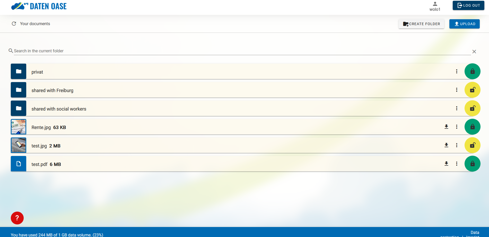

#  

DATEN OASE - Simple Nextcloud-UI for social work
Daten Oase is a simple and user-centered frontend for [Nextcloud](https://nextcloud.com). This cloud was created to give homeless people the possibility to store their documents for free: secure, simple and self-governed. It was developed within the context of the EU project *"Cloud for homeless people"* of the [AGJ-Fachverband Freiburg](https://agj-freiburg.de). To guarantee it's usefulness, the cloud was designed directly by AGJ-FREIBURG in collaboration with homeless people and social workers.

## SCREENSHOTS

## TECHSTACK - Daten Oase

| Project | Description | Information | Version |
| - | - | - | - |
| FRONTEND | Simple **VUE.js**-frontend designed by AGJ-FREIBURG | [vue](https://vuejs.org/) | [![vue-status]][vue-package] |
| BACKEND | Vanilla **Nextcloud** | [nextcloud] | [![nc-status]][nc-package] |

[vue]: https://github.com/vuejs/core
[vue-package]: https://www.npmjs.com/package/vue/v/2.7.10
[vue-status]: https://img.shields.io/badge/vue-2.7.14-brightgreen.svg

[nextcloud]: https://nextcloud.com/
[nc-package]: https://nextcloud.com/install/#instructions-server
[nc-status]: https://img.shields.io/badge/nextcloud-25.0.0-brightgreen.svg

## HOW TO INSTALL
Please click on an individual entry to learn more about it.
1. [Install Nextcloud](https://docs.nextcloud.com/server/latest/admin_manual/installation/index.html)
2. [Install our Vue.js-frontend](docs/3.install_frontend.md)
3. [Configure Nextcloud and Apache](https://github.com/AGJ-Freiburg/datenOase-Configs)

## CONTRIBUTORS
| TASK                       | PERSONS                                                          | 
| -------------              |-------------:                                                    | 
| Project lead               | [Moritz Bross](https://github.com/MoritzBross), [Robin Haensse](https://github.com/StandardWobin)             |
| Design lead                | [Moritz Bross](https://github.com/MoritzBross)                                              |
| Programming Lead           | [Robin Haensse](https://github.com/StandardWobin)                                                    |
| Programming                | [Niko Suchowitz](https://github.com/nSucho), [Robin Haensse](https://github.com/StandardWobin), [Moritz Bross](https://github.com/MoritzBross), [Bernhard Ruchti](https://github.com/bernhardlruchti)  |
| Acknowledgments            | Thomas Rutschmann, Stefan Heinz, Ilaria Mastrelli, Valentin Wels  |
| Advisory Board             | Dirk Dymarski, Corinna Lenhart, Robert Limmer, Stefan Kunz, Felix Neumann, Dr. Stefan Schneider, Gabi Rolland |

## WEB SOURCES
* [Project Page](https://cloud.agj-freiburg.de)
* [Documentation](https://www.caritas-digital.de/projekte/cloud-fuer-wohnungslose-menschen)
* [Press](https://background.tagesspiegel.de/smart-city/eine-cloud-fuer-wohnungslose-menschen)
* [Press](https://www.verlagshaus-jaumann.de/inhalt.kreis-loerrach-eine-cloud-fuer-mehr-teilhabe.da1375e9-b310-46c3-a5ce-18c8a3ac4c59.html)
* [Press](https://www.caritas.de/neue-caritas/heftarchiv/jahrgang2022/artikel/den-perso-immer-parat)

## QUESTIONS
Contact: wohnungslosenhilfe@agj-freiburg.de

